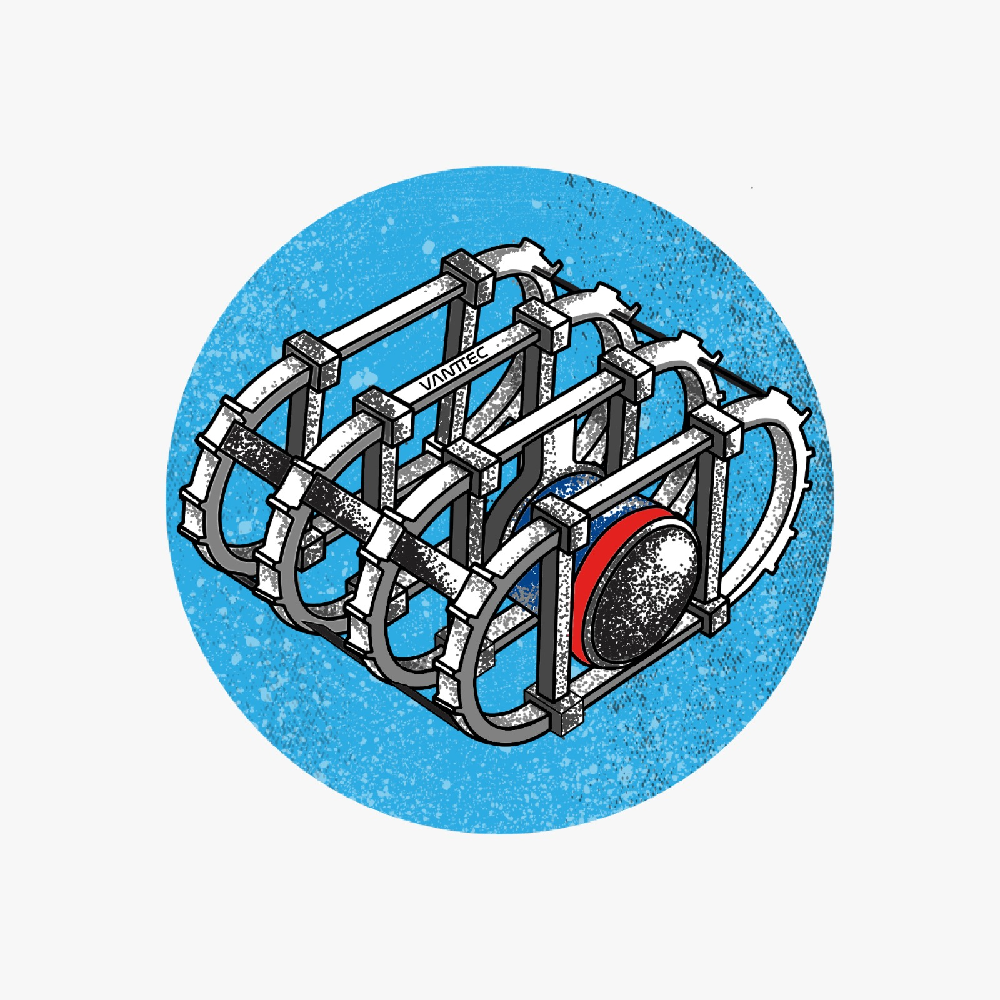
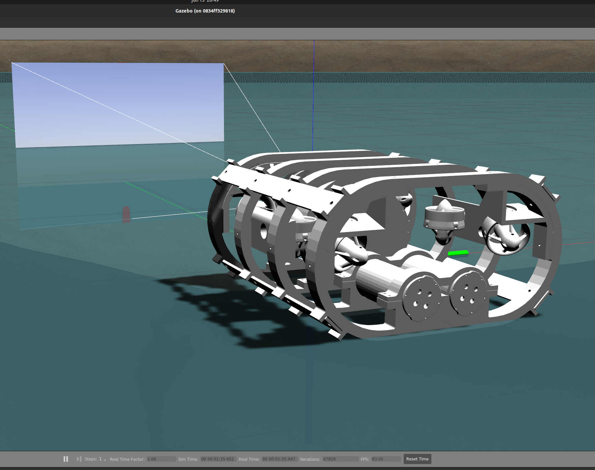

# Work in progress

<p align="right">
  
  
</p>


This is the UUV's main repository running with ROS Noetic and docker containers. Please consider the host you would be working on before starting: 1) jetson tx2, 2) OS without gpu, i.e., iOS, ubuntu20.04 or windows, 3) ubuntu20.04 with gpu.

**Running the workspace for the first time**

```Shell
cd
git clone --recurse-submodules https://github.com/vanttec/vanttec_uuv.git
cd vanttec_uuv && git checkout feature/integration
```

Inside the /vanttec_uuv/dockerfiles/ directory you would find the next three options: 
* jetsontx2
* ubuntu2004
* ubuntu2004_gpu

Each option contains a create_container.bash, so please select the one that suits you the most, e.g., the one for mac would be ./create_container_mac.bash.

```Shell
cd ~/vanttec_uuv/dockerfiles/{selected_option}
docker build -t uuv .
./create_container_gpu.bash
docker exec -it uuv /bin/bash

# Inside the container
cd /ws/vanttec_uuv/
catkin_make
source ~/.bashrc
```

**How to start working: host without gpu**

In this case, you would use the zed-open-capture project for manipulating the ZED camera and you must follow the next steps:

```Shell
cd /zed-open-capture
cd udev 
bash install_udev_rule.sh
cd ..
mkdir build
cd build
cmake ..
make -j$(nproc)
sudo make install
sudo ldconfig
```

** Do you want to validate your ROS packages? Use the Gazebo Simulator. **
Inside the docker follow the next steps:
```Shell
roslaunch uuv_gazebo lake.launch
```
Open a new terminal without closing the previous one and run the next:
```Shell
roslaunch uuv_description vtec_u3.launch
```
The result is shown next:

<p align="center">
  
</p>

Did you stop? Follow these steps to restart working.
```Shell
docker start uuv
docker exec -it uuv /bin/bash
```